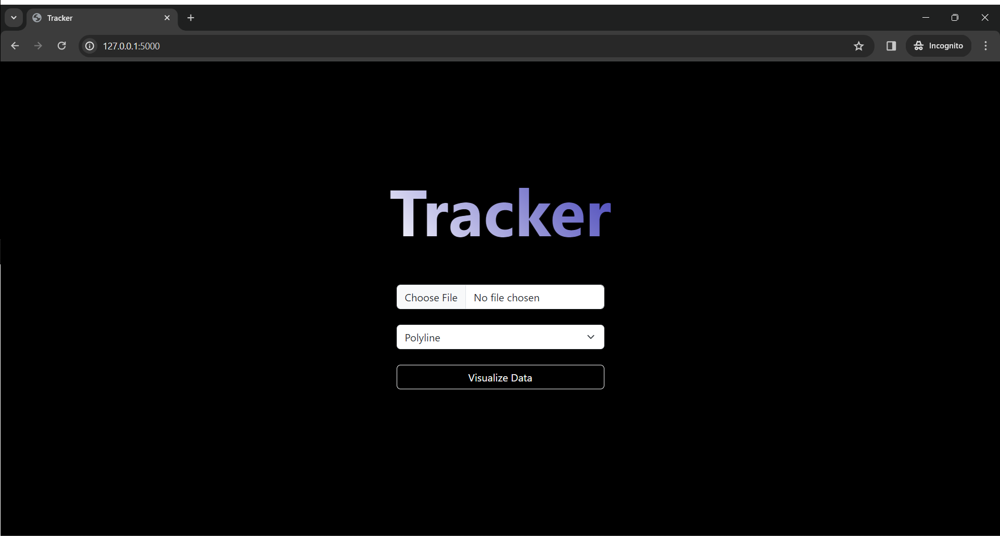
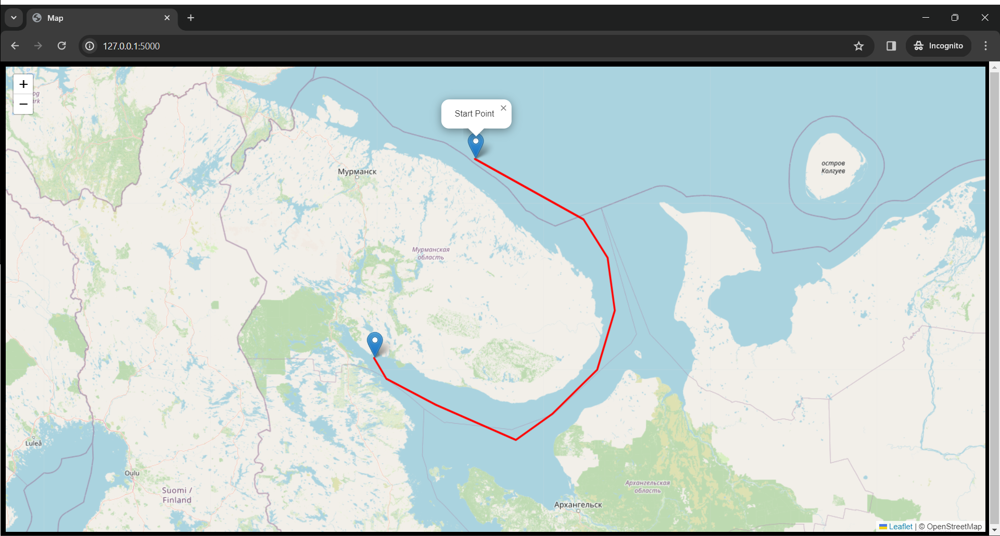

# Tracker | Python, HTML/CSS, JS, Bootstrap, Flask, Jinja, Leaflet.js, Pandas

## Description
**Tracker** is a straightforward web map application that enables users to visualize geographic coordinate data from CSV files as polylines or polygons on an interactive map. It draws inspiration from my very first GIS project, which involved visualizing manta tow tracing methods. This project was created as part of the CS50x program at Harvard University, utilizing a variety of tools, including Flask, Jinja, Pandas, and Leaflet.js.

## Key Features
- Upload CSV files containing latitude and longitude coordinates. Inside the "test_data" folder, you'll find sample data that you can use for testing and exploration.
- Display the uploaded data as polyline or polygon on an interactive map.
- Explore and interact with the map, allowing zooming in and out for more detailed views.

## Application Screenshot

## Contributions
Contributions, feedback, and suggestions are warmly welcomed. Feel free to enhance and expand the project to make it even more useful and feature-rich.

## Acknowledgments
I'd like to extend special thanks to the CS50x program from Harvard University for inspiring this project and providing the opportunity to learn and apply these valuable programming skills. You are encouraged to modify and expand this project description as needed for your GitHub repository. You can also add more specific details on how to run the project locally and outline any future development plans.

## Connect with me!
- [LinkedIn](https://www.linkedin.com/in/joshuaowm/)
- [Instagram](https://www.instagram.com/joshuaowm/)
- Email me at joshuaowm@gmail.com
